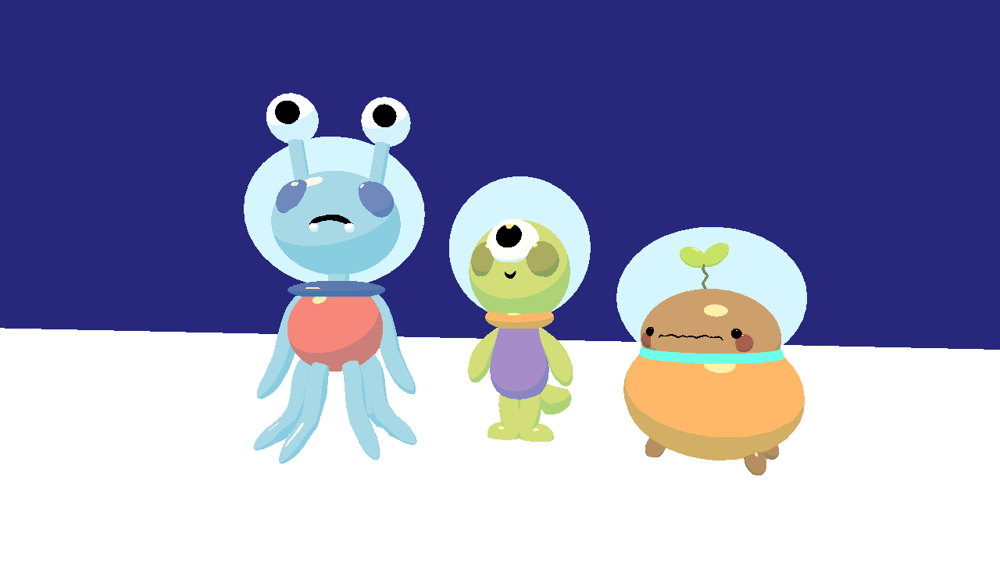
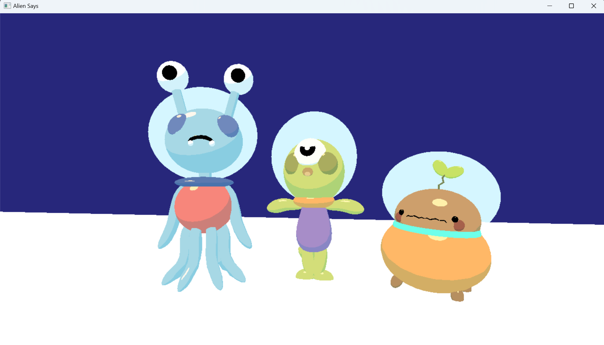

# Alien Says

Author: Taylor Kynard

Design: A simon says game in space!

Screen Shot:

How To Play:

use the arrow keys to select an alien, use space to confirm the selection. There is no strategy. Sadly the transforms got messed up so I didn't have time to add a selector to let you know which alien is selected but if you press the right arrow key three times you should be at the right alien. The background music was made with soundtrap and the alien sound effects were made in jxfr 

This game was built with [NEST](NEST.md).
