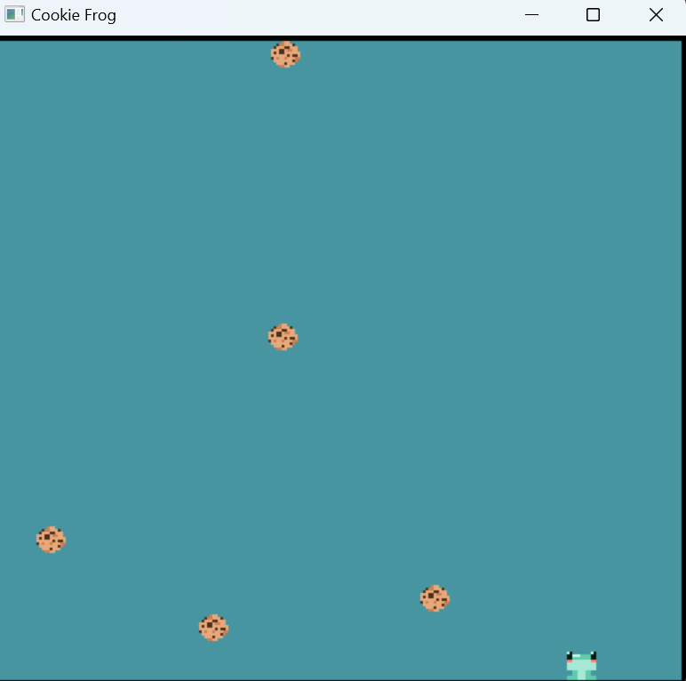
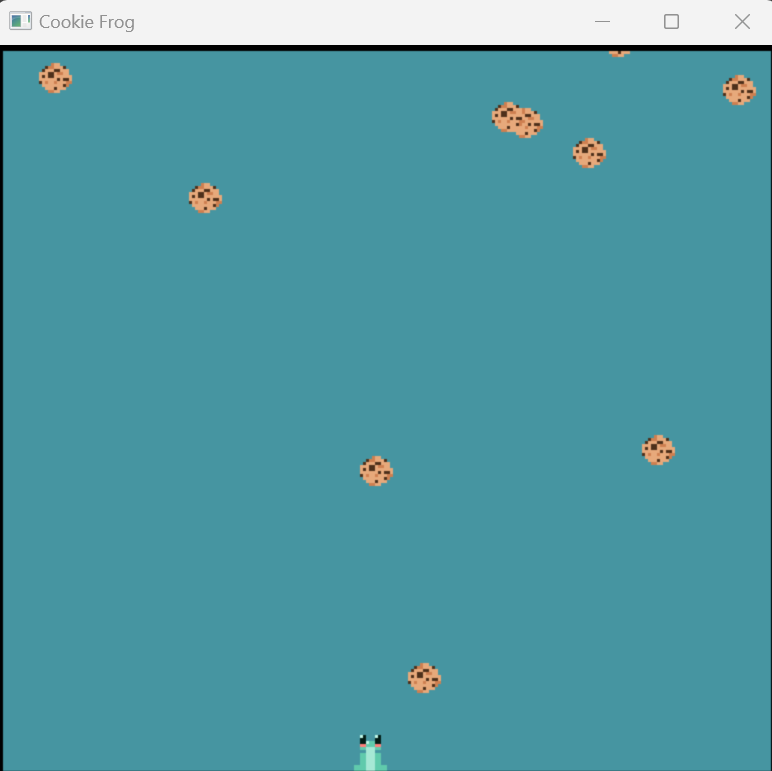

# Cookie Frog

Author: Taylor Kynard

Design: Instead of a claw machine, I made an endless cookie catching game where you play as a hungry frog trying to eat as many cookies as possible. If too many cookies fill up the screen, the game will end.

Screen Shot:

How Your Asset Pipeline Works:

The asset pipeline is able to create sprites from 8x8 pixel images;

if you make a 16x16 sprite for example, you can split each part into 4 8x8 images and import those into the game as their own separate tile maps.

The pipeline first reads in the path to the image and saves the data in a binary text file. Then the palette information and pixel information is extracted into separate vectors. If there are more than 4 colors, the program will throw an error. After getting the palette, it is put into the palette ppu at an index specified by the game designer - if the palette already exists for this given image there is an option to use that palette index instead of creating a new palette index. Next a tile map is created for the 8x8 image and saved into the tile map at an index specified by the game designer - if the tile map already exists for this given image there is an option to use that tile map instead of creating a new tile map index.

[frog 8x8 1](dist/frogs/greenFrogBR.png)
[frog 8x8 2](dist/frogs/greenFrogBL.png)
[frog 8x8 3](dist/frogs/greenFrogTR.png)
[frog 8x8 4](dist/frogs/greenFrogTL.png)

example of a full sprite

These are then put together manually in the draw function

How To Play:

Use the left and right mouse to move the frog towards the falling cookies!
(there is no strategy sadly - you are fated to loose no matter what)

This game was built with [NEST](NEST.md).

